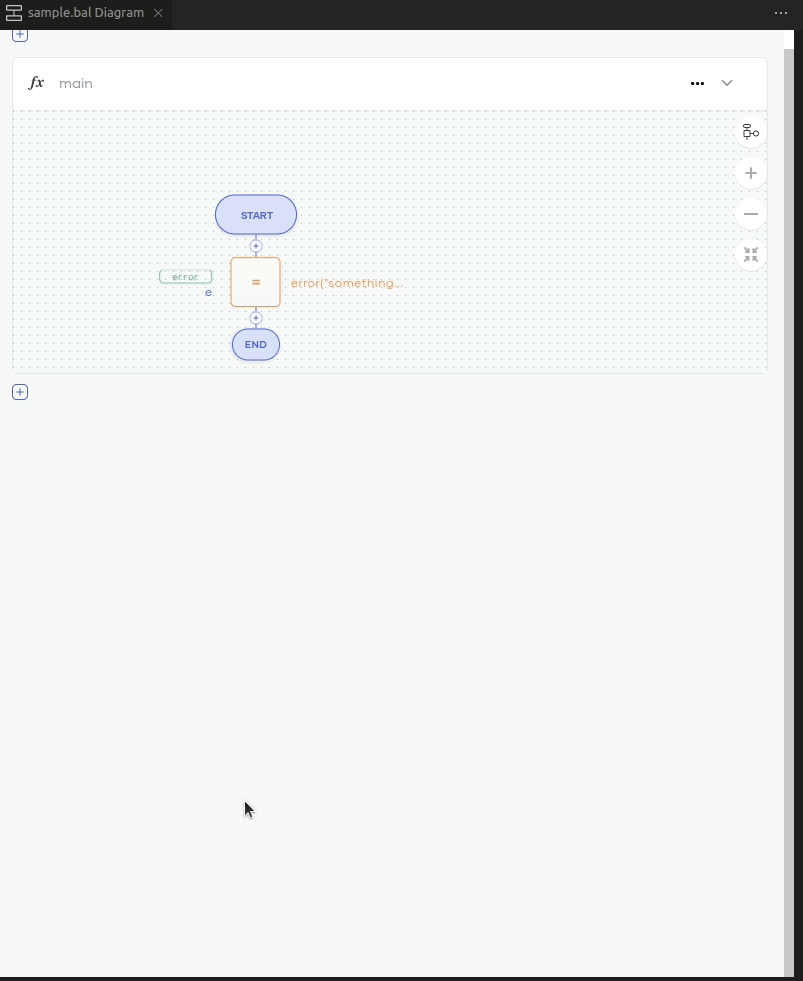
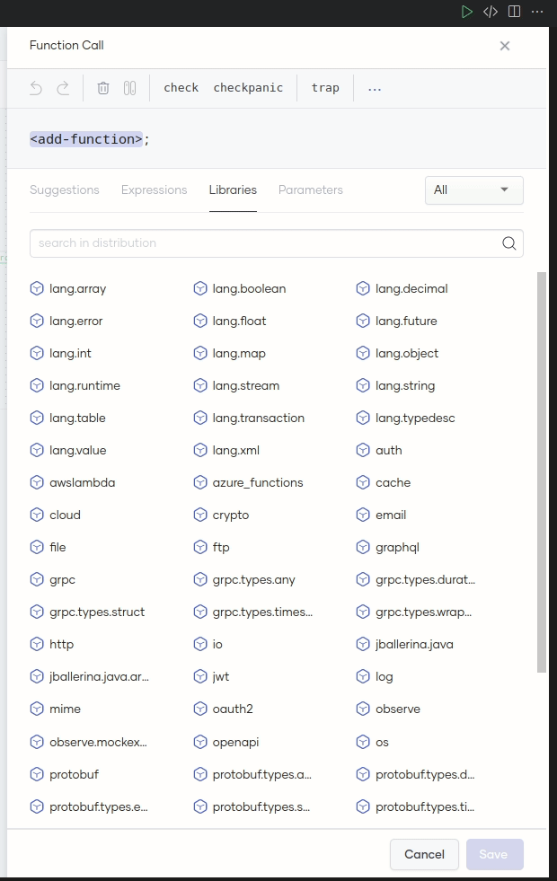

# Call a Ballerina Library function using the Statement Editor

Statement-editor allows you to easily navigate the Ballerina libraries which include Ballerina standard libraries and Ballerina language libraries. The **libraries** tab in Statement-editor lists all the supported standard and language libraries.

This guide helps you to understand	how to call a Ballerina library functions using the statement-editor.

Let's call the Ballerina [printError](https://lib.ballerina.io/ballerina/log/2.5.0/functions#printError) function of the [log module](https://lib.ballerina.io/ballerina/log/2.5.0) to log an error in the given sample code below

```
public function main() returns error? {

    error e = error("something went wrong!");
    // Add the function call to log and error
}

```

To build the log statement, follow these steps:

1. On the low-code diagram, click **+** within the main method. Then click **Function** in the **Add Constructs** pane that opens.

    

    The libraries tab will be selected by default listing all the supported Ballerina libraries

2. Search for **log** and select log module. This will list down all the supported functions, errors, records, type, etc.. in the log module. Select **log:printError** function.

    

    When you select a function or a method call, the **Parameters** tab opens by default. This tab displays information about the selected function or method call, including details about parameters, descriptions, and return type descriptions. On this tab, you can easily add parameters to the expression by selecting the checkboxes for the relevant parameters.

3. Double click on the **`<add-mgs>`** template and type "error log".

    

    Now we need to pass the **error - e** to the printError function. Let's follow the next steps

4. Select the checkbox of **error** from the parameter list. This will update the function with correct syntax to add the error. Then go to the **Suggestions** tab and select **e**, which is the previously defined error.

    

You will see the function call to be as follows without any diagnostics:

```
log:printError("error log", 'error = e);
```
Congratulations! You have constructed a valid function-call via the Statement Editor!

You can click **Save** to add the function-call to the low-code diagram.
