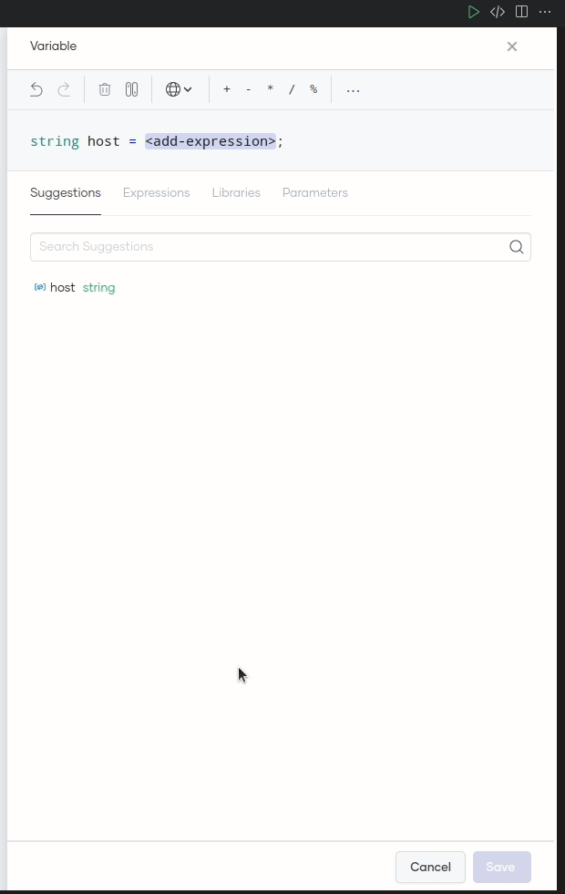
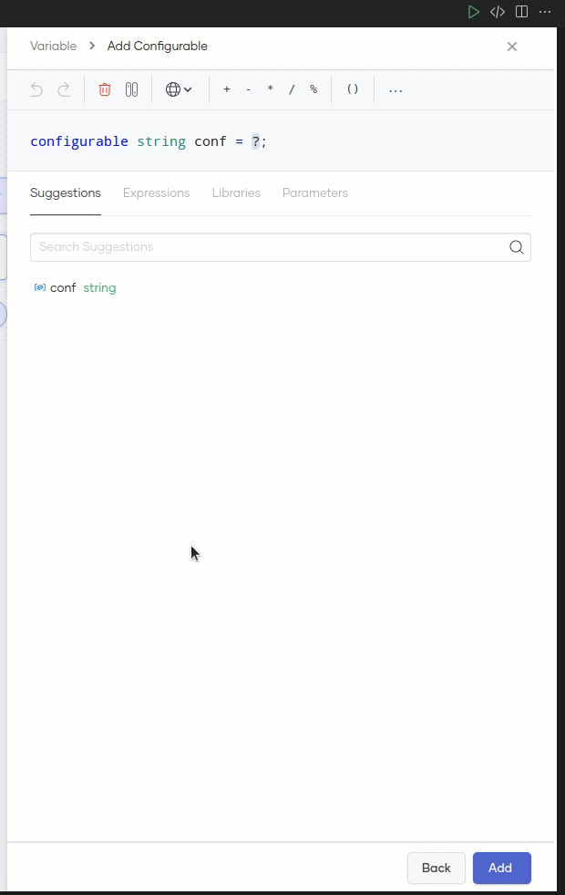

# Define a configurable variable using the Statement Editor

As you develop your construct, you may identify a parameter for which the value needs to be configurable and for which you have not already defined the required configurable. Then, you can access the configurable variable template while defining/editing the current statement. 

Follow the steps below if you are adding a variable and you want to make its value configurable.

For example, when you create a variable `host` of type **string**, if you decide the value of this variable should be configurable,

1. Click on the **`<add-expression>`** template and click the **Add-configurable** button in the toolbar.

    


    This opens up a new pane with the configurable variable statement template.

 2. Update the variable name and value as required. 
 
 3. Click the **Add** button. This adds the configurable variable to the source code and updates the current statement as shown below. 

    

A new configurable variable gets generated in the source code as shown below.

 ```ballerina
 configurable string dbHost = "localhost";
 ```
